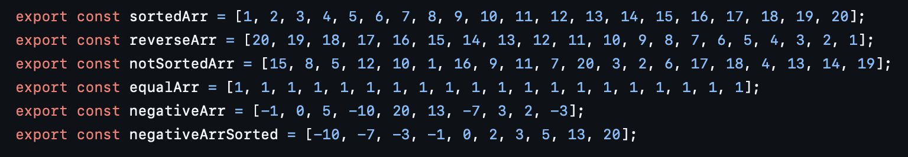

# Explorando Práticas de Teste

Neste exercício, vamos explorar práticas de teste em sistemas reais utilizando a ferramenta [TestMiner](https://andrehora.github.io/testminer).

O TestMiner permite visualizar e analisar testes de software em repositórios do GitHub, fornecendo dados sobre como os projetos organizam seus testes, como eles evoluem entre versões e quais bibliotecas de teste são utilizadas.
Explore a ferramenta antes de começar para se familiarizar com seu funcionamento.

---

## Passo 1: Selecionar um repositório

Escolha um repositório real que possua testes escritos na linguagem de sua preferência.
Abaixo estão alguns links para ajudá-lo a encontrar projetos interessantes:

- **Python:** https://github.com/topics/python?l=python
- **JavaScript:** https://github.com/topics/javascript?l=javascript
- **TypeScript:** https://github.com/topics/typescript?l=typescript
- **Java:** https://github.com/topics/java?l=java

## Passo 2: Explorar o repositório selecionado

Busque o repositório escolhido no [TestMiner](https://andrehora.github.io/testminer) e analise os dados de teste gerados pela ferramenta.

## Passo 3: Explicar uma prática de teste

Com base nos dados obtidos, selecione uma prática ou dado de teste relevante e explique-o com suas próprias palavras.

---

## Instruções de entrega

1. Faça um `fork` deste repositório (saiba mais sobre forks [aqui](https://docs.github.com/pt/pull-requests/collaborating-with-pull-requests/working-with-forks/fork-a-repo)).
2. Responda às questões abaixo diretamente neste arquivo `README.md` do seu fork. Pode adicionar imagens para enriquecer sua explicação.
3. No Moodle, submeta apenas a URL do seu fork.

---

## Respostas

**1. Repositório selecionado:** (https://github.com/trekhleb/javascript-algorithms.git)

**2. Explicação:** 
O repositório selecionado contém exemplos baseados em JavaScript de muitos algoritmos e estruturas de dados populares, de modo que os testes incluem algoritmos matemáticos (como Fibonacci, fatorial, etc), ordenação, busca e diversas estruturas de dados (como lista encadeada, pilha, fila, heap, árvores, grafos). 
Uma prática relevante recorrente neste repositório é a análise de valores limite, ou seja, o teste de valores nas extremidades dos intervalos de entrada e saída de um algoritmo, que se baseiam no fato de que erros frequentemente ocorrem nos limites de dados aceitos (ou em valores próximos).

Alguns exemplos podem ser vistos nesses cenários:
1. Algoritmos matemáticos: testes dos casos bases de recursão em algoritmos como Fibonacci e fatorial, ou seja, dos limites inferiores do algoritmo. Nesse caso, respectivamente, 1 e 0. 

2. Algoritmos de ordenação e busca: os limites desses casos não são numéricos, mas se referem ao tamanho do vetor de entrada, de modo que são testados como entrada vetores vazios, de apenas um elemento, com elementos repetidos, dentre outros casos. Além disso, vetores já ordenados também são utilizados como entrada para teste do comportamento das funções nesses casos. Estes casos são definidos na própria biblioteca e reaproveitados para diversos testes distintos. 

3. Estruturas de dados: as extremidades são definidas de acordo com a estrutura. Alguns exemplos são lista vazia ou com apenas um nó, operações no início ou no fim de uma lista, heap, pilha, etc ou também nós "especiais" de uma árvore: os nós e as folhas.

Uma observação sobre esses testes, no entanto, é que faltam alguns "edge cases", como entradas negativas para algoritmos matemáticos como os mencionados anteriormente. Para melhorar a cobertura, seria ideal acrescentar estes casos àqueles já cobertos pelos de valores limite. 